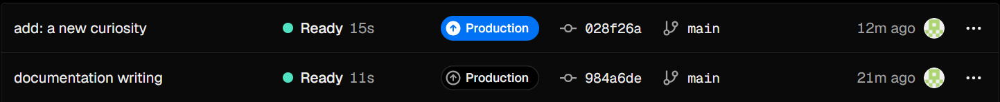
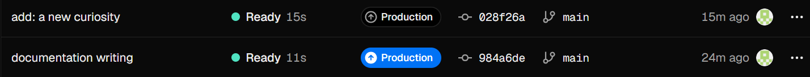

# Validation

## Health
- Méthod : GET 
- URL: https://cp-8-lanterne-e57h.vercel.app/api/health
- Status attendu : 200
- Status obtenu : 200

## Curiosities
- Méthod : GET
- URL: https://cp-8-lanterne-e57h.vercel.app/curiosities
- Status attendu : 200
- Status obtenu : 200

## Curiosities/:slug
- Méthod : GET
- URL: https://cp-8-lanterne-e57h.vercel.app/curiosities/:slug
- Status attendu : 200
- Status obtenu : 200

## Route not found
- Méthod : GET
- URL: https://cp-8-lanterne-e57h.vercel.app/api/index.js
- Status attendu : 404
- Status obtenu : 404

# Validation d'une nouvelle version : 
Une fois les modifications effectué sur le fichier `curiosities.json`, nous devons effectuer les commandes : 
``` bash
git add * 
git commit -m "add a new curiosity"
git push
```

Sur vercel l'état du déploiement passe à `ready` ce qui signifie que les modifications du commit on était apporté et passe en production.



Une fois les modifications effectué nous pouvons effectuer la procédure de retour en utilisant `promote` dans la liste des commits qui restaure l'api vers une version ultérieur et repassant en production.

