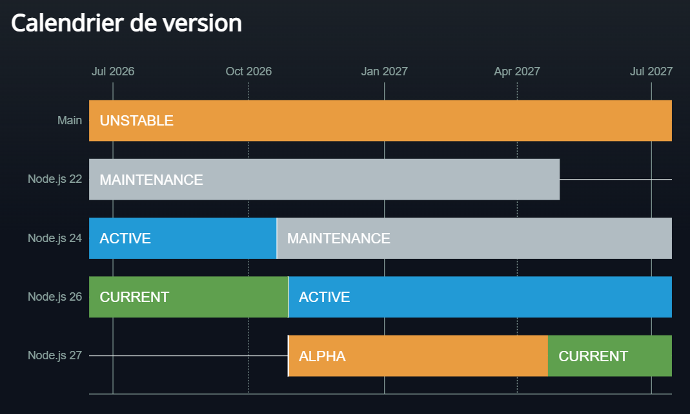

# Veille CP8_Lanterne

## Arborescence du projet
```text
CP8_Lanterne/           
│   ├── data
│   │    └── curiosities.json
│   └── index.js
├── docs/                   
│   ├── deploiement-vercel.md
│   ├── validation.md
│   └── veille.md
├── tests/ 
│   └── api.test.js
├── .env.example           
├── .gitignore             
├── package.json          
├── README.md 
└── vercel.json          
```

## Détails utiles: 

**Le point d'entré express** : `index.js`.

**Dépendances:** 
- cors
- express

**Installation de pnpm :** `npm install -g pnpm`

**Versions:**
- Node version: v26.10.0
- pnpm version : 11.19.0

**Scripts:**
- "start": "node api/index.js",
- "dev": "node --watch api/index.js",
- "check": "node --check api/index.js && node --check tests/api.test.js",
- "test": "node tests/api.test.js

## Les routes

- /health
- /curiosities
- /curiosities/:slug

## Fichiers non transmis dans git 

- node_modules/
- .env
- vercel.json

## Sécuriser la configuration

**Evolution de Node.js**


Source: https://nodejs.org/fr/about/previous-releases#calendrier-de-version

Les versions récentes de Node.js finissent par arriver en fin de support. Il est donc important de maintenir Node.js à jour afin d’éviter des problèmes de compatibilité ou de sécurité lors du déploiement.

Il est recommandé de :

* vérifier la version de Node.js utilisée par le projet avec `node -v`
* mettre à jour node si nécessaire

**Date de consultation : 22 septembre 2026.**